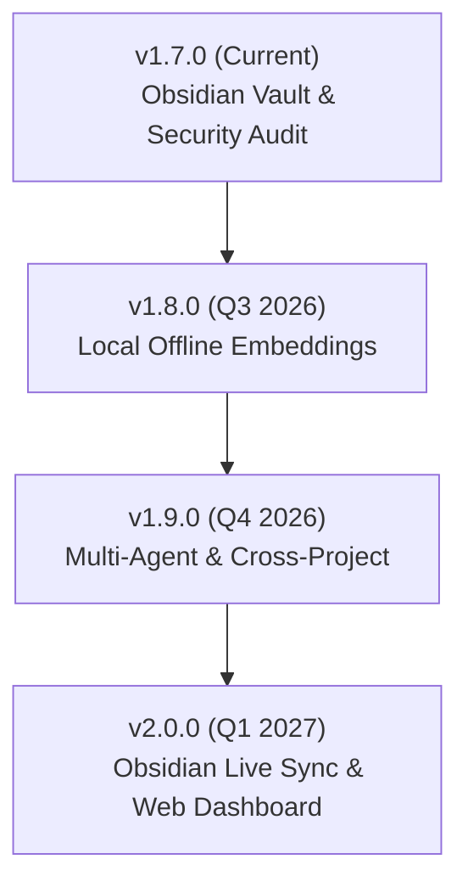

# 🚀 Rencana Kerja & Roadmap Masa Depan — codex-dev-mcp-suite

> **Repository:** [verrysimatupang99/codex-dev-mcp-suite](https://github.com/verrysimatupang99/codex-dev-mcp-suite)  
> **Versi Terbaru:** `v1.7.0` (Obsidian Vault Grade & Codebase Security Audit)  
> **Lisensi:** MIT  

---

## 📌 Status Terkini (v1.7.0)

Rilis `v1.7.0` baru saja digabung (*merged*) ke `master` & dipublikasikan dengan pencapaian:
- ✅ **Obsidian Vault Parity**: Dukungan `.obsidian` setup otomatis, `memory_moc` (Map of Content), `memory_graph`, dan format Markdown standar Obsidian (`[[WikiLinks]]`).
- ✅ **Codebase Security Audit (`pack_audit`)**: Tool otomatis untuk deteksi kebocoran file sensitif (`.env`, `.pem`, `id_rsa`), deteksi kunci API ter-hardcode, file besar, dan kelengkapan `.gitignore`.
- ✅ **Stabilitas & Test**: **97 / 97 unit test (100% PASS)** di seluruh 4 server MCP + 3 utility CLI.

---

## 🎯 Roadmap Pengembangan Kedepan

---

### 1. 🟢 v1.8.0 — Local Offline Semantic Search & ONNX Embedding
> **Fokus:** Menjadikan `project-memory` 100% mandiri tanpa butuh API key eksternal untuk pencarian semantik.

- [ ] **Engine Embedding Lokal (WASM/ONNX)**:
  - Integrasi `@xenova/transformers` / ONNX Runtime Web dengan model ringan (`all-MiniLM-L6-v2` atau `bge-small-en-v1.5`).
  - Pencarian semantik otomatis berfungsi saat laptop *offline* / tanpa jaringan internet.
- [ ] **Fast Keyword-Semantic Hybrid Search**:
  - Penggabungan BM25 / TF-IDF keyword search dengan cosine similarity vektor lokal.
- [ ] **Smart Cache Vector Storage**:
  - Menyimpan cache vektor di `.project-memory/vectors.json` tanpa membuat ketergantungan database eksternal.

---

### 2. 🔵 v1.9.0 — Multi-Agent Sync & Cross-Project Memory
> **Fokus:** Koordinasi memori antar sub-agent AI dan pengelolaan memori lintas proyek.

- [ ] **Multi-Agent Timeline Stream (`devjournal_stream`)**:
  - Live event stream untuk melihat log & status pengerjaan subagent secara real-time.
- [ ] **Cross-Project Memory Link (`memory_crosslink`)**:
  - Menghubungkan dokumentasi/solusi bug dari proyek A ke proyek B (misal: solusi konfigurasi server/VPS bisa dipakai ulang di proyek aplikasi).
- [ ] **Subagent Handoff Lock (`handoff_claim`)**:
  - Mencegah dua subagent menimpa *handoff log* yang sama secara bersamaan.

---

### 3. 🟣 v2.0.0 — Native IDE GUI & Obsidian Live 2-Way Sync
> **Fokus:** Pengalaman pengguna (*Developer Ergonomics*) tingkat lanjut & visualisasi grafik.

- [ ] **Obsidian 2-Way Live Sync**:
  - Sinkronisasi otomatis secara dua arah: editan di Obsidian Desktop langsung ter-update di `project-memory` AI, dan sebaliknya.
- [ ] **Web Dashboard & GUI (`npx codex-dev-mcp-suite ui`)**:
  - Dashboard web lokal berbasis Svelte/React ringan untuk melihat grafik proyek, statistik memori, checkpoint diff, dan timeline devjournal.
- [ ] **Git Pre-commit Hook Integration**:
  - Integrasi `pack_audit` langsung ke `.git/hooks/pre-commit` untuk mencegah developer sengaja/tidak sengaja memuat `.env` atau *secret key* ke repository.

---

### 🟡 Peningkatan Berkelanjutan (Ongoing Maintenance)
- [ ] **Templates Kredensial & Preset MCP**:
  - Konfigurasi siap pakai untuk Cursor, Claude Code, Windsurf, VS Code, dan Antigravity.
- [ ] **CI/CD Auto-Publish**:
  - GitHub Actions pipeline untuk auto-build & test saat ada `tag` baru.
