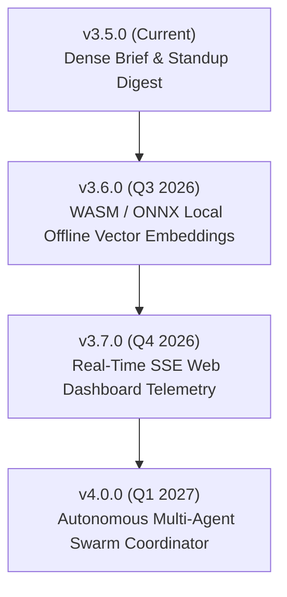

# 🚀 Rencana Kerja & Roadmap Masa Depan — codex-dev-mcp-suite

> **Repository:** [verrysimatupang99/codex-dev-mcp-suite](https://github.com/verrysimatupang99/codex-dev-mcp-suite)  
> **Versi Terbaru:** `v3.5.0` (Token-Dense Briefing, Standup Digest & Semantic Session Import)  
> **Lisensi:** MIT  

---

## 📌 Status Terkini (v3.5.0)

Rilis `v3.5.0` telah dirilis & dipublikasikan ke NPMJS dengan pencapaian:
- ✅ **Token-Dense Briefing (`pack_dense_brief`)**: Overviews ringkas berdensitas tinggi untuk menghemat 30–50% context window token saat inisialisasi sesi.
- ✅ **Daily Standup Generator (`journal_standup`)**: Ringkasan otomatis handoff, bugfix terbaru, dan blocker lintas sesi.
- ✅ **Direct Session Log Importer (`memory_import_session`)**: Ekstraksi keputusan arsitektur langsung dari file `.jsonl`/`.log` sesi agent.
- ✅ **Fast Substring & Task Finder (`pack_find_todos`, `pack_search`)**: Pencarian TODO dan substring konten tanpa spawn proses eksternal.
- ✅ **Unified Multi-File Checkpoint (`checkpoint_diff`)**: Deteksi perubahan file lokal sebelum refactoring masif.
- ✅ **Stabilitas & Test**: **113 / 113 unit test (100% PASS)** di seluruh 4 server MCP + utility CLI.

---

## 🎯 Roadmap Pengembangan Kedepan

---

### 1. 🟢 v3.6.0 — Pure Offline ONNX / WASM Embeddings
> **Fokus:** Menjadikan semantic search `project-memory` 100% mandiri tanpa ketergantungan API eksternal saat offline.

- [ ] **Engine Embedding Lokal (WASM/ONNX)**:
  - Integrasi model ringan (`all-MiniLM-L6-v2` / `bge-small-en-v1.5`) via `@xenova/transformers` / ONNX runtime.
  - Semantic similarity search berjalan mulus saat laptop offline atau di jaringan terbatas.
- [ ] **Hybrid Search Ranking**:
  - Algoritma gabungan BM25 keyword matching + cosine vector similarity score.
- [ ] **Zero-Dependency Vector Cache**:
  - Penyimpanan vektor lokal teroptimasi di `.ai-shared-memory/vectors/` tanpa database eksternal.

---

### 2. 🔵 v3.7.0 — Real-Time Live Telemetry Web Dashboard (`mcp-ui`)
> **Fokus:** Visualisasi interaktif realtime saat subagent dan developer bekerja.

- [ ] **Live SSE / WebSocket Event Stream**:
  - Live reload di `http://localhost:3333` saat agent memanggil `checkpoint_create`, `memory_save`, atau `journal_log`.
- [ ] **Visual 3D Knowledge Graph Explorer**:
  - Tampilan visual relasi antar catatan Obsidian vault dan dependensi project.
- [ ] **Interactive Checkpoint Rollback**:
  - Kemampuan rollback / restore checkpoint file langsung dari web GUI.

---

### 3. 🟣 v4.0.0 — Autonomous Multi-Agent Swarm Coordinator
> **Fokus:** Koordinasi tim AI (Antigravity, Hermes, Claude Code, Codex CLI) pada codebase enterprise.

- [ ] **Distributed File Lock & Conflict Resolver (`swarm_mutex`)**:
  - Mencegah dua agent mengedit file yang sama secara bersamaan.
- [ ] **Shared Memory Cross-Linking (`memory_crosslink`)**:
  - Memori dan solusi masalah dari proyek A otomatis dapat di-recall saat menangani proyek B.
- [ ] **Automated Code Review Agent Hook**:
  - Integrasi pre-commit / pre-push guard yang memvalidasi blast radius sebelum commit dibuat.

---

### 🟡 Peningkatan Berkelanjutan (Ongoing Maintenance)
- [x] **CI/CD Auto-Publish on Tag**:
  - GitHub Actions workflow (`.github/workflows/publish.yml`) untuk test & auto-publish ke npmjs saat git tag di-push.
- [x] **Universal Client Detection**:
  - Installer wizard (`npx codex-dev-mcp-suite init`) mendukung Antigravity, Codex, Claude Code, Cursor, Windsurf, dan Hermes.
